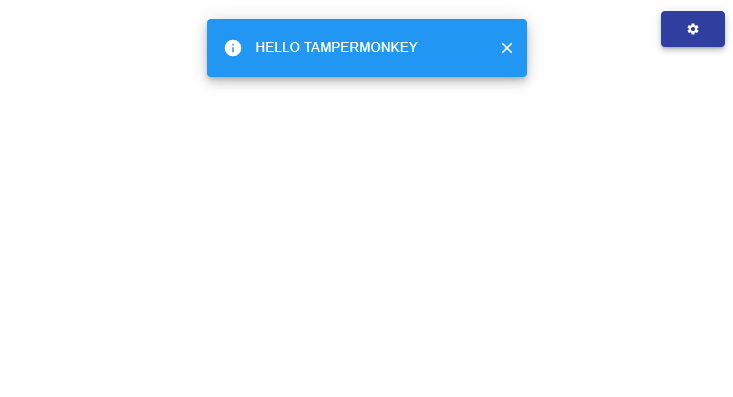
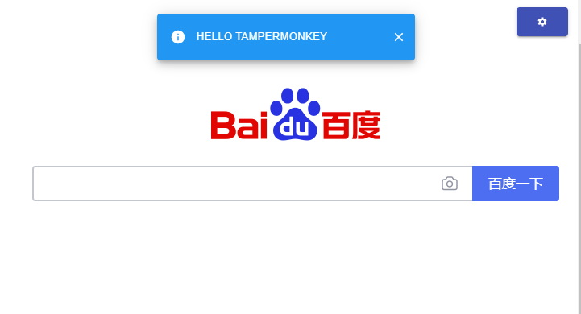

# 本模板已迁移至 [quick-scaffold](https://github.com/xiaomingTang/quick-scaffold)
 ---
# template-react-tampermonkey

### description
让油猴也能用上**typescript** + **react** + **material-ui**

------
development preview:


------
production preview:

### usage
```
# cmd
> git clone git@github.com:xiaomingTang/template-react-tampermonkey.git
> cd template-react-tampermonkey
> yarn
```

- **yarn start**: 经由**WebpackDevServer**+**HotModuleReplacementPlugin**, 尽享更畅快的开发
- **yarn run build**: 构建到**dist**目录, 且内容自动复制到剪贴板, 之后手动拷贝到油猴输入框即可
- **yarn run bundle**: 调用Webpack Bundle Analyzer分析打包情况

### 项目特点
- 模板来自[templete-ts-react](https://github.com/xiaomingTang/templete-ts-react)
- 自动添加油猴脚本描述(详见[config/Constants.js](config/Constants.js))
- 自动复制到剪贴板
- [x] typescript
- [x] babel
- [x] react
- [x] material-ui
- [x] production模式下支持 webpack externals(详见[config/Constants.js](config/Constants.js))
- [x] 油猴内置函数的类型支持(详见[config/Constants.js](config/Constants.js)和[https://github.com/silverwzw/Tampermonkey-Typescript-Declaration](https://github.com/silverwzw/Tampermonkey-Typescript-Declaration))
- [x] eslint
- [x] less and module less
